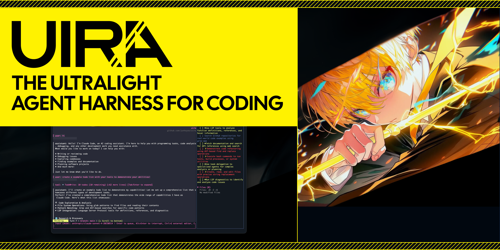
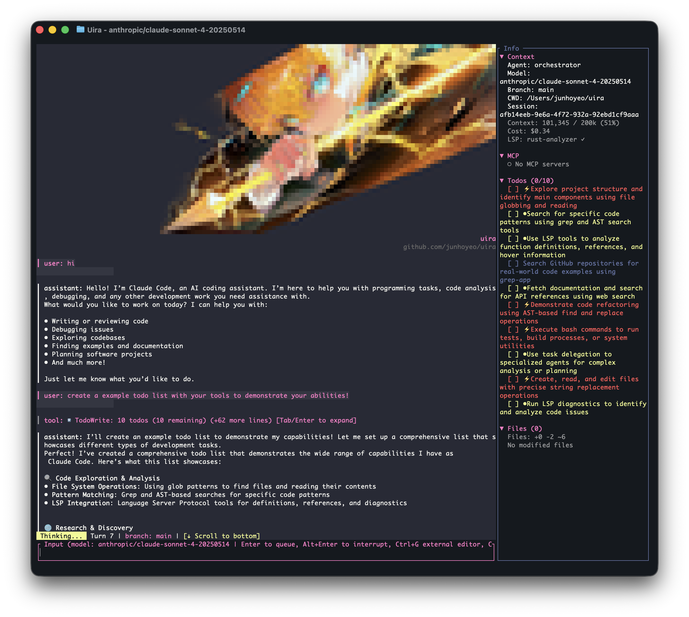

<!-- <CENTERED SECTION FOR GITHUB DISPLAY> -->

<div align="center">

[](https://github.com/junhoyeo/uira)

</div>



> A lightweight, secure AI agent harness for your entire development lifecycle — built in Rust.

<div align="center">

[](https://github.com/junhoyeo/uira/releases)
[](https://www.npmjs.com/package/@uiradev/uira)
[](https://www.npmjs.com/package/@uiradev/uira)
[](https://github.com/junhoyeo/uira/stargazers)
[](https://github.com/junhoyeo/uira/issues)
[](https://github.com/junhoyeo/uira/blob/main/LICENSE)

</div>

<!-- </CENTERED SECTION FOR GITHUB DISPLAY> -->

<!-- TODO: Add TUI screenshots -->
<!-- | TUI Chat | Model Selector | -->
<!-- |:---:|:---:| -->
<!-- |  |  | -->
<!-- | Approval Overlay | Session Branching | -->
<!-- |:---:|:---:| -->
<!-- |  |  | -->

## Overview

**Uira** (Māori: "lightning") is a standalone AI coding agent built entirely in Rust. It combines multi-provider model orchestration, platform-native sandboxing, and AI-powered developer workflows into a single binary with zero external runtime dependencies.

Three pillars:

- **Lightweight** — Single Rust binary. No Node.js, no Python, no Docker. Fast startup, low memory footprint.
- **Secure** — Platform-native sandboxing (macOS Seatbelt, Linux Landlock), configurable permission rules with glob patterns, and inline TUI approval overlays for every tool invocation.
- **Dev Lifecycle** — Not just an agent — a complete harness. AI-assisted git hooks, score-based goal verification, session branching, semantic memory, and channel integrations (Slack, Telegram, Discord) from commit to deploy.

## Contents

- [Overview](#overview)
- [Features](#features)
- [Quick Start](#quick-start)
  - [Credential Setup](#credential-setup)
- [Usage](#usage)
  - [Interactive TUI](#interactive-tui)
  - [Single Task Execution](#single-task-execution)
  - [Session Management](#session-management)
  - [Configuration Management](#configuration-management)
  - [Goal Verification](#goal-verification)
  - [Background Tasks](#background-tasks)
  - [Gateway](#gateway)
  - [Skills](#skills)
  - [Shell Completions](#shell-completions)
- [TUI Commands & Shortcuts](#tui-commands--shortcuts)
  - [Slash Commands](#slash-commands)
  - [Keyboard Shortcuts](#keyboard-shortcuts)
  - [Model Selector](#model-selector)
- [Configuration](#configuration)
  - [Config File Locations](#config-file-locations)
  - [Full Reference](#full-reference)
- [Multi-Provider Model Routing](#multi-provider-model-routing)
  - [Agent Personalities](#agent-personalities)
- [Security & Sandboxing](#security--sandboxing)
  - [Platform-Native Sandbox](#platform-native-sandbox)
  - [Permission System](#permission-system)
  - [Approval Overlay](#approval-overlay)
- [AI Agent Harness](#ai-agent-harness)
  - [AI-Assisted Commands](#ai-assisted-commands)
  - [Git Hook Integration](#git-hook-integration)
- [Session Persistence](#session-persistence)
- [MCP Integration](#mcp-integration)
  - [Built-in MCP Server](#built-in-mcp-server)
  - [External MCP Servers](#external-mcp-servers)
- [Gateway & Channels](#gateway--channels)
- [Architecture](#architecture)
- [Development](#development)
- [Contributing](#contributing)
- [License](#license)

## Features

- **Standalone Native Binary** — Zero-dependency Rust binary, no Node.js or Python required
- **Multi-Provider Orchestration** — Anthropic, OpenAI, Gemini, Ollama, and OpenCode with per-agent model routing
- **Platform-Native Sandboxing** — macOS Seatbelt (`sandbox-exec`), Linux Landlock — not containers, real OS-level isolation
- **Ratatui TUI** — Terminal interface with approval overlays, model selector, thinking display, and syntax highlighting
- **AI Agent Harness** — Embedded agent workflows for typos, diagnostics, and comment review at commit time
- **MCP Server & Client** — Built-in LSP and AST-grep tools via Model Context Protocol, plus external MCP server discovery
- **Session Persistence** — Append-only JSONL sessions with branching, forking, and resume
- **Goal Verification** — Score-based verification loops for persistent task completion
- **Semantic Memory** — Local hybrid search memory system with embedding support
- **Gateway & Channels** — WebSocket gateway with Telegram, Slack, and Discord integrations
- **Skills System** — Loadable SKILL.md instruction files for extending agent capabilities
- **Smart Context Compaction** — Automatic context summarization to stay within token limits
- **OAuth Authentication** — Multi-provider OAuth with secure credential storage
- **OXC Tooling** — Rust-native JavaScript/TypeScript linting, parsing, and transformation

## Quick Start
```bash
# Install via npm (prebuilt binaries, recommended)
npm i -g @uiradev/uira
# Or via npx (no install, scoped package)
npx @uiradev/uira
# Or via unscoped alias package
npx uira
# Explicitly run specific bundled binaries from npm package
npx -p @uiradev/uira uira-agent --version
npx -p @uiradev/uira uira-commit-hook-cli --help
# Or build from source
git clone https://github.com/junhoyeo/uira
cd uira
cargo build --release
cargo install --path crates/uira-cli
```

**npm packages:**

| Package | Description | Binaries |
|---------|-------------|----------|
| [`@uiradev/uira`](https://www.npmjs.com/package/@uiradev/uira) | Agent + git hooks (prebuilt) | `uira`, `uira-agent`, `uira-commit-hook-cli` |
| [`@uiradev/hook`](https://www.npmjs.com/package/@uiradev/hook) | Git hooks only | `uira-hook` |
| [`uira`](https://www.npmjs.com/package/uira) | Alias for `@uiradev/uira` | Same as above |

`uira-agent` is a binary exposed by `@uiradev/uira`, not a standalone npm package name. For npx execution of that binary, use `npx -p @uiradev/uira uira-agent`.

Platform-specific binaries are bundled via `optionalDependencies` — supports macOS (arm64, x64), Linux (x64/arm64, glibc/musl), and Windows (x64).

### Credential Setup

Credentials are resolved per-provider in the following priority order:

| Priority | Source | Details |
|----------|--------|---------|
| 1 | OAuth login | `uira-agent auth login <provider>` — stored in `~/.uira/auth.json` |
| 2 | Environment variable | `ANTHROPIC_API_KEY`, `OPENAI_API_KEY`, etc. |

**Environment variables** per provider:

| Provider | Variable | Notes |
|----------|----------|-------|
| Anthropic | `ANTHROPIC_API_KEY` | Default provider |
| OpenAI | `OPENAI_API_KEY` | Also supports OAuth (Codex) |
| Gemini | `GEMINI_API_KEY` or `GOOGLE_API_KEY` | Either works |
| Ollama | — | No auth required (local) |
| OpenCode | `OPENCODE_API_KEY` | For OpenCode session API |

**OAuth** (recommended — tokens auto-refresh):
| Provider | Flow | Notes |
|----------|------|-------|
| Anthropic | Code-copy | Opens browser → authorize → copy code → paste in terminal |
| OpenAI | Device code | Automatic polling |
| Google | Device code | Automatic polling |
```bash
uira-agent auth login anthropic   # Start OAuth flow
uira-agent auth login openai
uira-agent auth login google
uira-agent auth status            # Check all credentials
uira-agent auth logout anthropic  # Remove stored credentials
```

Credentials stored in `~/.uira/auth.json`.

## Usage

### Interactive TUI

```bash
# Launch the interactive terminal UI (default)
uira-agent

# With a specific model
uira-agent --model claude-sonnet-4-20250514

# With a specific provider
uira-agent --provider openai --model gpt-4o

# Full-auto mode (no approval prompts)
uira-agent --full-auto

# Ralph mode (persistent task completion)
uira-agent --ralph

# With a specific agent personality
uira-agent --agent architect
```

### Single Task Execution

```bash
# Execute a prompt non-interactively
uira-agent exec "Fix the TypeScript errors in src/"

# Output as JSON
uira-agent exec "Summarize this codebase" --json
```

### Session Management

```bash
# List recent sessions
uira-agent sessions list

# List with fork tree structure
uira-agent sessions list --tree

# Show session details
uira-agent sessions info <session-id>

# Delete a session
uira-agent sessions delete <session-id>

# Resume a previous session
uira-agent resume <session-id>

# Fork from a session (branch point)
uira-agent resume <session-id> --fork

# Fork keeping only the first N messages
uira-agent resume <session-id> --fork --fork-at 10
```

### Configuration Management

```bash
# Show current config
uira-agent config show

# Get a specific value
uira-agent config get theme

# Set a value
uira-agent config set theme dracula

# Reset to defaults
uira-agent config reset
```

### Goal Verification

```bash
# Run all goal checks
uira-agent goals check

# List configured goals
uira-agent goals list

# Show verification status
uira-agent goals status
```

### Background Tasks

```bash
# List running tasks
uira-agent tasks list

# Check task status
uira-agent tasks status <task-id>

# Cancel a task
uira-agent tasks cancel <task-id>
```

### Gateway

```bash
# Start the WebSocket gateway server
uira-agent gateway start

# With custom host/port
uira-agent gateway start --host 0.0.0.0 --port 18790

# With authentication
uira-agent gateway start --auth-token "secret"
```

### Skills

```bash
# List discovered skills
uira-agent skills list

# Show skill details
uira-agent skills show <name>

# Install a skill from a local path
uira-agent skills install ./my-skill/
```

### Shell Completions

```bash
# Generate completions for your shell
uira-agent completion bash >> ~/.bashrc
uira-agent completion zsh >> ~/.zshrc
uira-agent completion fish >> ~/.config/fish/completions/uira-agent.fish
```

## TUI Commands & Shortcuts

### Slash Commands

| Command | Description |
|---------|-------------|
| `/help`, `/h`, `/?` | Show available commands |
| `/models` | Open model selector (keyboard-driven) |
| `/model <name>` | Switch to a specific model |
| `/fork [name]` | Branch from the current session point |
| `/switch <branch>` | Switch to another session branch |
| `/branches` | List available session branches |
| `/tree` | Show session branch tree |
| `/review` | Review staged git changes |
| `/review <file>` | Review changes for a specific file |
| `/review HEAD~1` | Review a specific commit |
| `/theme` | List available TUI themes |
| `/theme <name>` | Switch theme (default, dark, light, dracula, nord) |
| `/share [--public] [--description <text>]` | Share session as a GitHub Gist |
| `/clear` | Clear chat history |
| `/status`, `/auth` | Show connection status |
| `/exit`, `/quit`, `/q` | Exit |

### Keyboard Shortcuts

| Key | Action |
|-----|--------|
| `Enter` | Send message |
| `↑` / `↓` | Navigate input history |
| `Mouse wheel` | Scroll chat view |
| `PageUp` / `PageDown` | Scroll chat view |
| `←` / `→` | Move cursor in input |
| `Ctrl+G` | Open external editor for composing input |
| `Ctrl+C` | Quit |
| `Ctrl+L` | Clear screen |
| `Esc` | Quit / Close overlay |

### Model Selector

Press `/models` to open an interactive model selector:
- `↑` / `↓` or `j` / `k` — Navigate models
- `←` / `→` or `h` / `l` — Switch provider groups
- `Enter` — Select model
- `Esc` — Cancel

## Configuration

### Config File Locations

Configuration is loaded from the project root in priority order:

| Priority | File | Format |
|----------|------|--------|
| 1 (highest) | `uira.jsonc` | JSON with comments |
| 2 | `uira.json` | Standard JSON |
| 3 | `uira.yml` / `uira.yaml` | YAML |

Also checks hidden variants (`.uira.*`) and `~/.config/uira/` for global config. Environment variables in values (`${VAR}`) are expanded automatically.

### Full Reference

```jsonc
{
  // ── TUI ───────────────────────────────────────────────────────
  "theme": "default",                     // "default" | "dark" | "light" | "dracula" | "nord"
  "theme_colors": {
    "bg": "#282a36",                      // All hex, optional per-color overrides
    "fg": "#f8f8f2",
    "accent": "#ff79c6",
    "error": "#ff5555",
    "warning": "#f1fa8c",
    "success": "#50fa7b",
    "borders": "#6272a4"
  },

  "show_logo": true,                      // Show startup logo in chat view
  "sidebar": {
    "show_context": true,
    "show_mcp": true,
    "show_todos": true,
    "show_files": true
  },
  "keybinds": {},                          // Custom keybindings (see docs)

  // ── Providers ─────────────────────────────────────────────────
  "agents": {
    "explore": { "model": "gpt-4o-mini" },           // Fast, cheap model for exploration
    "architect": { "model": "claude-opus-4" },        // Powerful model for architecture
    "executor": { "model": "claude-sonnet-4" }        // Balanced model for execution
  },

  "opencode": {
    "host": "127.0.0.1",                  // OpenCode server host
    "port": 4096,                         // OpenCode server port
    "timeout_secs": 120,
    "auto_start": true                    // Auto-start OpenCode server if not running
  },

  "providers": {
    "anthropic": {
      "payload_log": {
        "enabled": false,
        "path": null
      }
    }
  },

  // ── Security ──────────────────────────────────────────────────
  "permissions": {
    "rules": [
      { "name": "allow-workspace", "permission": "file_write", "pattern": "$CWD/**", "action": "allow" },
      { "name": "deny-secrets", "permission": "file_read", "pattern": "~/.ssh/**", "action": "deny" },
      { "name": "ask-network", "permission": "network_access", "pattern": "*", "action": "ask" }
    ]
  },

  // ── AI Harness ────────────────────────────────────────────────
  "hooks": {
    "pre_commit": {
      "parallel": false,
      "commands": [
        { "name": "typos", "run": "uira-commit-hook-cli typos --ai", "on_fail": "stop" },
        { "name": "diagnostics", "run": "uira-commit-hook-cli diagnostics --ai --cached --severity error", "on_fail": "stop" },
        { "name": "comments", "run": "uira-commit-hook-cli comments --ai --cached", "on_fail": "warn" }
      ]
    }
  },

  "typos": {
    "ai": { "model": "anthropic/claude-sonnet-4-20250514" }
  },
  "diagnostics": {
    "ai": {
      "model": "anthropic/claude-sonnet-4-20250514",
      "severity": "error",                // "error" | "warning" | "all"
      "confidence_threshold": 0.8,
      "languages": ["js", "ts", "tsx", "jsx"]
    }
  },
  "comments": {
    "ai": {
      "model": "anthropic/claude-sonnet-4-20250514",
      "pragma_format": "@uira-allow",     // Pragma to preserve comments
      "include_docstrings": false
    }
  },

  // ── Goal Verification ─────────────────────────────────────────
  "goals": {
    "auto_verify": true,
    "check_interval_secs": 30,
    "max_iterations": 100,
    "goals": [
      { "name": "test-coverage", "command": "./scripts/coverage.sh", "target": 80.0, "timeout_secs": 60 },
      { "name": "build-check", "command": "cargo build --release && echo 100", "target": 100.0 }
    ]
  },

  // ── Context Management ────────────────────────────────────────
  "compaction": {
    "enabled": true,
    "threshold": 0.8,                     // Compact when context reaches 80% of limit
    "protected_tokens": 40000,            // Always keep this many recent tokens
    "strategy": "summarize"               // "summarize" | "truncate"
  },

  // ── MCP ───────────────────────────────────────────────────────
  "mcp": {
    "servers": [
      { "name": "filesystem", "command": "npx", "args": ["-y", "@anthropic/mcp-server-filesystem", "/path/to/workspace"] },
      { "name": "github", "command": "npx", "args": ["-y", "@anthropic/mcp-server-github"] }
    ]
  },

  // ── Skills ────────────────────────────────────────────────────
  "skills": {
    "enabled": false,
    "paths": ["~/.uira/skills", ".uira/skills"],
    "active": []
  },

  // ── Gateway & Channels ───────────────────────────────────────
  "gateway": {
    "enabled": false,
    "host": "127.0.0.1",
    "port": 18790,
    "max_sessions": 10,
    "model": "claude-sonnet-4-20250514",
    "provider": "anthropic",
    "default_agent": "balanced",          // "balanced" | "autonomous" | "orchestrator"
    "idle_timeout_secs": 1800
  },

  "channels": {
    "telegram": {
      "bot_token": "${TELEGRAM_BOT_TOKEN}",
      "allowed_users": ["your_username"],
      "stream_mode": "partial",
      "stream_throttle_ms": 300
    },
    "slack": {
      "bot_token": "${SLACK_BOT_TOKEN}",
      "app_token": "${SLACK_APP_TOKEN}",
      "allowed_channels": ["C0123456789"]
    },
    "discord": {
      "bot_token": "${DISCORD_BOT_TOKEN}"
    }
  },

  // ── Memory ────────────────────────────────────────────────────
  "memory": {
    "enabled": false
  }
}
```

## Multi-Provider Model Routing

Uira routes to the appropriate provider based on model ID prefix:

| Model Pattern | Provider |
|---------------|----------|
| `claude-*`, `anthropic/*` | Anthropic API |
| `gpt-*`, `openai/*` | OpenAI API |
| `gemini-*`, `google/*` | Google Gemini API |
| `ollama/*`, `llama*` | Ollama (local) |
| `opencode/*` | OpenCode session API |

Route different agents to different models:

```jsonc
{
  "agents": {
    "explore": { "model": "gpt-4o-mini" },      // Fast exploration
    "architect": { "model": "claude-opus-4" },   // Deep reasoning
    "executor": { "model": "claude-sonnet-4" }   // Balanced execution
  }
}
```

### Agent Personalities

Select an agent personality with `--agent <name>`. Each agent has an embedded system prompt tuned for its domain, with tiered variants for different model budgets:

| Agent | Description | Default Model |
|-------|-------------|---------------|
| `architect` | Architecture & debugging advisor | opus |
| `architect-medium` | Architecture — moderate complexity | sonnet |
| `architect-low` | Quick code questions & lookups | haiku |
| `explore` | Fast codebase pattern matching | haiku |
| `explore-medium` | Moderate codebase exploration | sonnet |
| `explore-high` | Deep codebase exploration | opus |
| `librarian` | Multi-repo analysis & documentation retrieval | sonnet |
| `designer` | UI/UX specialist | sonnet |
| `designer-high` | Complex UI architecture & design systems | opus |
| `designer-low` | Simple styling & minor UI tweaks | haiku |
| `writer` | Technical writing | haiku |
| `vision` | Visual analysis (images, diagrams) | sonnet |
| `planner` | Strategic implementation planning | opus |
| `analyst` | Pre-planning requirements consultant | sonnet |
| `critic` | Plan & work reviewer | opus |
| `scientist` | Data & ML specialist | sonnet |
| `scientist-high` | Complex research & hypothesis testing | opus |
| `scientist-low` | Quick data inspection | haiku |
| `code-reviewer` | Comprehensive code quality review | opus |
| `code-reviewer-low` | Quick code quality check | haiku |
| `security-reviewer` | Security vulnerability audits | opus |
| `security-reviewer-low` | Quick security scan | haiku |
| `build-fixer` | Build & type error resolution | sonnet |
| `build-fixer-low` | Trivial type errors & single-line fixes | haiku |
| `tdd-guide` | Test-driven development workflows | sonnet |
| `tdd-guide-low` | Quick test suggestions | haiku |
| `qa-tester` | CLI testing & verification | opus |
| `qa-tester-high` | Comprehensive production-ready QA | opus |

**Orchestrator personalities** (top-level session orchestration mode):

| Personality | Description |
|-------------|-------------|
| `balanced` | Default — balanced autonomy and user interaction |
| `autonomous` | Maximum autonomy, minimal prompting |
| `orchestrator` | Multi-agent coordination mode |

## Security & Sandboxing

### Platform-Native Sandbox

Every subprocess spawned by the agent runs inside a platform-native sandbox:

| Platform | Technology | Capabilities |
|----------|------------|--------------|
| macOS | Seatbelt (`sandbox-exec`) | File access, network, process restrictions via policy strings |
| Linux | Landlock | Filesystem access control with per-path read/write/execute rights |

```bash
# Sandbox policies
uira-agent --sandbox read-only          # No writes anywhere
uira-agent --sandbox workspace-write    # Write only in project dir (default)
uira-agent --sandbox full-access        # Unrestricted (use with caution)
uira-agent --sandbox custom --sandbox-rules ./rules.json  # Custom rules
```

### Permission System

Configurable permission rules with glob pattern matching and last-match-wins semantics:

```jsonc
{
  "permissions": {
    "rules": [
      // Allow writes in workspace
      { "permission": "file_write", "pattern": "$CWD/**", "action": "allow" },

      // Block reading SSH keys
      { "permission": "file_read", "pattern": "~/.ssh/**", "action": "deny" },

      // Block destructive commands
      { "permission": "shell_execute", "pattern": "rm -rf *", "action": "deny" },

      // Prompt user for network access
      { "permission": "network_access", "pattern": "*", "action": "ask" }
    ]
  }
}
```

**Supported permissions:** `file_read`, `file_write`, `file_delete`, `shell_execute`, `network_access`, `mcp_tool`, `tool`

**Actions:** `allow`, `deny`, `ask` (prompts user via TUI overlay)

### Approval Overlay

When a tool requires approval (`action: ask`), the TUI shows an inline overlay at the bottom of the chat:

- `Y` — Approve this request
- `A` — Always allow (cached per session and pattern)
- `N` — Deny this request

Approval decisions are cached with TTL and persisted to disk for faster repeated approvals.

## AI Agent Harness

The harness system integrates AI agents into your git workflow. An embedded agent runs autonomously with full tool access (Read, Edit, Grep, Glob, Write, Bash) until the task is verified complete.

```
┌─────────────────────────────────────────────────────────────────────────────────┐
│                              Developer Workflow                                  │
└─────────────────────────────────────────────────────────────────────────────────┘
                                       │
                     ┌─────────────────┴─────────────────┐
                     ▼                                   ▼
            ┌────────────────┐                  ┌────────────────┐
            │  Manual CLI    │                  │   Git Commit   │
            │  Invocation    │                  │    Trigger     │
            └────────────────┘                  └────────────────┘
                     │                                   │
                     │                                   ▼
                     │                          ┌────────────────┐
                     │                          │  .git/hooks/   │
                     │                          │  pre-commit    │
                     │                          └────────────────┘
                     │                                   │
                     │                                   ▼
│                          ┌─────────────────────────┐
│                          │  uira-commit-hook-cli   │
│                          │  run pre-commit         │
│                          └─────────────────────────┘
                     │                                   │
                     └─────────────────┬─────────────────┘
                                       ▼
┌─────────────────────────────────────────────────────────────────────────────────┐
│                    uira-commit-hook-cli (AI Harness)                             │
├─────────────────────────────────────────────────────────────────────────────────┤
│                                                                                  │
│  ┌──────────────────────┐  ┌──────────────────────────┐  ┌───────────────────────┐│
│  │ uira-commit-hook-cli │  │   uira-commit-hook-cli   │  │ uira-commit-hook-cli  ││
│  │ typos --ai           │  │   diagnostics --ai       │  │ comments --ai         ││
│  └──────────┬───────────┘  └────────────┬─────────────┘  └───────────┬───────────┘│
│           │                    │                    │                           │
│           └────────────────────┼────────────────────┘                           │
│                                ▼                                                 │
│  ┌──────────────────────────────────────────────────────────────────────────┐   │
│  │                         AgentWorkflow                                     │   │
│  │                                                                           │   │
│  │  • Embedded agent session (same harness as uira-agent)                   │   │
│  │  • Full tool access: Read, Edit, Grep, Glob, Write, Bash,                │   │
│  │    WebSearch, CodeSearch, GrepApp, FetchUrl                              │   │
│  │  • Runs autonomously until <DONE/> is output                             │   │
│  │  • Verification via re-detection (no remaining issues)                   │   │
│  │  • Git diff-based modification tracking                                  │   │
│  │                                                                           │   │
│  └──────────────────────────────────────────────────────────────────────────┘   │
│                                                                                  │
└─────────────────────────────────────────────────────────────────────────────────┘
                                 │
                                 ▼
┌─────────────────────────────────────────────────────────────────────────────────┐
│                           Model Providers                                        │
├─────────────────────────────────────────────────────────────────────────────────┤
│                                                                                  │
│    ┌──────────────┐    ┌──────────────┐    ┌──────────────┐                     │
│    │  Anthropic   │    │   OpenAI     │    │   Gemini     │                     │
│    │   Claude     │    │    GPT       │    │              │                     │
│    └──────────────┘    └──────────────┘    └──────────────┘                     │
│                                                                                  │
└─────────────────────────────────────────────────────────────────────────────────┘
                                 │
                                 ▼
┌─────────────────────────────────────────────────────────────────────────────────┐
│                            Agent Workflow Loop                                   │
├─────────────────────────────────────────────────────────────────────────────────┤
│                                                                                  │
│  1. Detect Issues         2. Agent Fixes            3. Verify & Complete        │
│  ┌───────────────┐        ┌───────────────┐        ┌───────────────┐            │
│  │ typos CLI     │───────▶│ Agent uses    │───────▶│ Re-detect     │            │
│  │ lsp_diagnostics│       │ Read/Edit/Bash│        │ issues = 0?   │            │
│  │ comment-checker│       │ to fix issues │        │ → <DONE/>     │            │
│  └───────────────┘        └───────────────┘        └───────────────┘            │
│                                                                                  │
│  4. Stage Changes (default)    5. Continue/Fail Hook                            │
│  ┌───────────────┐             ┌───────────────┐                                │
│  │ git add <file>│────────────▶│ Exit 0 (pass) │                                │
│  │ (--no-add skip│             │ Exit 1 (fail) │                                │
│  └───────────────┘             └───────────────┘                                │
│                                                                                  │
└─────────────────────────────────────────────────────────────────────────────────┘
```

### AI-Assisted Commands

| Command | Description | AI Decisions |
|---------|-------------|--------------|
| `uira-commit-hook-cli typos --ai` | Detect and fix typos | FIX, IGNORE per typo |
| `uira-commit-hook-cli diagnostics --ai` | Fix LSP errors/warnings | FIX:HIGH, FIX:LOW, IGNORE |
| `uira-commit-hook-cli comments --ai` | Review/remove comments | REMOVE, KEEP per comment |

Additional commands: `init`, `install`, `run`, `lint`, `format`, `goals`, `agent`, `session`, `skill`

### Git Hook Integration

```bash
# Initialize configuration
uira-commit-hook-cli init

# Install git hooks
uira-commit-hook-cli install

# Commit normally — hooks run automatically
git commit -m "feat: add new feature"
```

When you commit, the pre-commit hook executes:
```
.git/hooks/pre-commit
    └── exec uira-commit-hook-cli run pre-commit
            └── Runs configured commands from uira.yml
                    ├── uira-commit-hook-cli typos --ai
                    ├── uira-commit-hook-cli diagnostics --ai
                    └── uira-commit-hook-cli comments --ai
```

### Hook Configuration Example

```yaml
# uira.yml
pre-commit:
  parallel: false
  commands:
    - name: format
      run: uira-commit-hook-cli format --check
    - name: typos
      run: uira-commit-hook-cli typos --ai
      on_fail: stop
    - name: diagnostics
      run: uira-commit-hook-cli diagnostics --ai --cached --severity error
      on_fail: stop
    - name: comments
      run: uira-commit-hook-cli comments --ai --cached
      on_fail: warn
```
## Session Persistence

Sessions are saved as append-only JSONL files:

```bash
# Sessions stored in
~/.uira/sessions/<session-id>.jsonl

# Resume a session
uira-agent resume <session-id>

# Fork from a specific point
uira-agent resume <session-id> --fork --fork-at 10

# View as JSON for debugging
cat ~/.uira/sessions/<session-id>.jsonl | jq
```

Session branching creates a tree of related sessions. Use `/fork` in the TUI or `--fork` on the CLI to branch from any point.

## MCP Integration

### Built-in MCP Server

The `uira-mcp-server` binary exposes development tools via Model Context Protocol:

**LSP Tools:**

| Tool | Description |
|------|-------------|
| `lsp_goto_definition` | Jump to symbol definition |
| `lsp_find_references` | Find all references to a symbol |
| `lsp_symbols` | List symbols in a file or workspace |
| `lsp_diagnostics` | Get errors and warnings |
| `lsp_hover` | Get type info and documentation |
| `lsp_rename` | Rename a symbol across files |

**AST Tools:**

| Tool | Description |
|------|-------------|
| `ast_search` | Search code patterns with ast-grep |
| `ast_replace` | Search and replace code patterns |

### External MCP Servers

Connect to any MCP-compatible server. Tools are auto-discovered and exposed to the agent:

```jsonc
{
  "mcp": {
    "servers": [
      { "name": "filesystem", "command": "npx", "args": ["-y", "@anthropic/mcp-server-filesystem", "/path/to/workspace"] },
      {
        "name": "github",
        "command": "npx",
        "args": ["-y", "@anthropic/mcp-server-github"],
        "env": { "GITHUB_TOKEN": "${GITHUB_TOKEN}" }
      }
    ]
  }
}
```

## Gateway & Channels
The gateway provides a WebSocket control plane for managing multiple concurrent agent sessions, with channel integrations for team messaging.
```jsonc
{
  "gateway": {
    "enabled": true,
    "host": "0.0.0.0",
    "port": 18790,
    "max_sessions": 10,
    "auth_token": "${GATEWAY_AUTH_TOKEN}",  // Optional Bearer token for WebSocket auth
    "default_agent": "balanced"             // "balanced" | "autonomous" | "orchestrator"
  },
  "channels": {
    "telegram": {
      "bot_token": "${TELEGRAM_BOT_TOKEN}",
      "allowed_users": ["your_username"],
      "stream_mode": "partial"              // Progressive message editing
    },
    "slack": {
      "bot_token": "${SLACK_BOT_TOKEN}",
      "app_token": "${SLACK_APP_TOKEN}",
      "allowed_channels": ["C0123456789"]
    },
    "discord": {
      "bot_token": "${DISCORD_BOT_TOKEN}"
    }
  }
}
```

Start the gateway:
```bash
# Start with defaults from config
uira-agent gateway start

# Or override host/port
uira-agent gateway start --host 0.0.0.0 --port 18790
# With authentication
uira-agent gateway start --auth-token "your-secret-token"
```

**Endpoints:**

| Endpoint | Description |
|----------|-------------|
| `ws://<host>:<port>/ws` | WebSocket connection for session management |
| `http://<host>:<port>/health` | Health check (returns uptime, active sessions, version) |

## Architecture

| Crate | Purpose |
|-------|---------|
| **uira-cli** | CLI entry point with session management and multi-provider support |
| **uira-agent** | Core agent loop with state machine, session persistence, streaming, and telemetry |
| **uira-tui** | Ratatui-based terminal UI with approval overlays and syntax highlighting |
| **uira-core** | Configuration loading, management, and event system |
| **uira-providers** | Model provider clients (Anthropic, OpenAI, Gemini, Ollama, OpenCode) with OAuth |
| **uira-security** | Platform-native sandboxing (Seatbelt, Landlock) + permission evaluation engine |
| **uira-orchestration** | Agent definitions, SDK, features, tool registry, and hook implementations |
| **uira-mcp-client** | MCP client for consuming external MCP tools |
| **uira-mcp-server** | MCP server with LSP and AST-grep tools |
| **uira-oxc** | OXC-powered JavaScript/TypeScript linting, parsing, and transformation |
| **uira-comment-checker** | Comment detection using tree-sitter |
| **uira-commit-hook-cli** | Git hooks manager with AI harness |
| **uira-gateway** | WebSocket gateway with Telegram, Slack, and Discord channel integrations |
| **uira-memory** | Local semantic memory with hybrid search |

## Development

```bash
# Build all crates
cargo build --workspace

# Run tests
cargo test --workspace

# Run the CLI in development mode
cargo run -p uira-cli

# Run with debug logging
RUST_LOG=debug cargo run -p uira-cli

# Check formatting
cargo fmt --all -- --check

# Run linter
cargo clippy --workspace -- -D warnings
```

## Contributing

1. Fork the repository
2. Create a feature branch (`git checkout -b feat/amazing-feature`)
3. Make your changes
4. Run tests (`cargo test --workspace`)
5. Commit using conventional format (`feat:`, `fix:`, `refactor:`, `docs:`, `test:`, `chore:`, `perf:`)
6. Push and open a Pull Request

Always use merge commits when merging PRs.

## License

<p align="center">
  <a href="https://github.com/junhoyeo">
    
  </a>
</p>

<p align="center">
  <strong>MIT © <a href="https://github.com/junhoyeo">Junho Yeo</a></strong>
</p>

[](https://github.com/junhoyeo/uira)

If you find this project intriguing, **please consider starring it ⭐** or [follow me on GitHub](https://github.com/junhoyeo) and join the ride. I code around the clock and ship mind-blowing things on a regular basis — your support won't go to waste.
