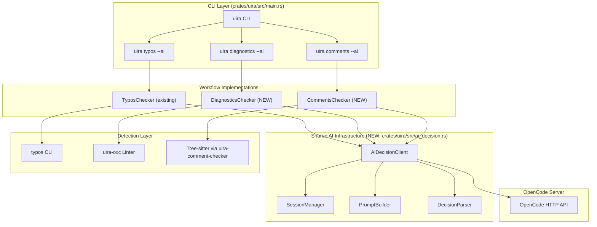
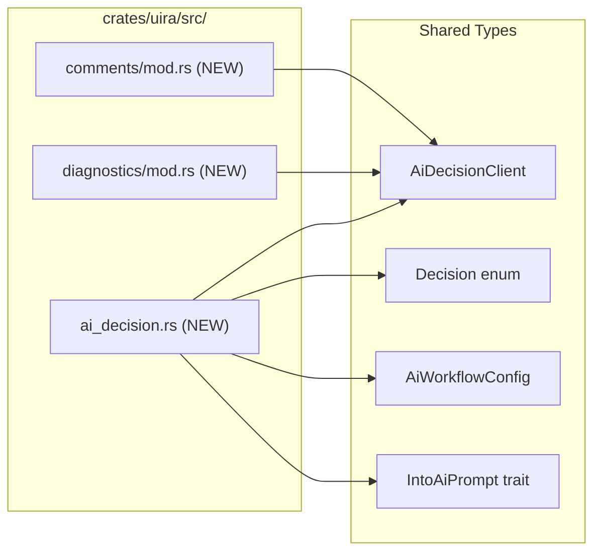
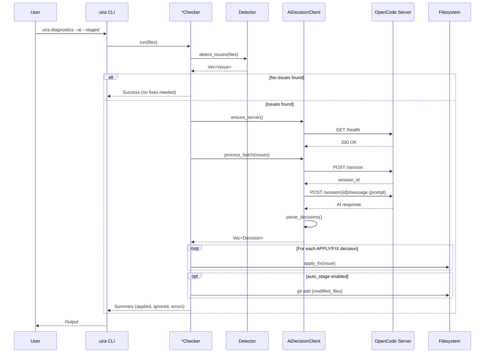

# Original User Request (For Record)
"make comprehensive surgeon level production grade plan with code references" for AI-assisted diagnostics and comments workflows following the typos --ai pattern.

## Additional User Requests (For Record)
- Full AI-assisted fixing workflows for diagnostics and comments
- Extract shared AI decision infrastructure from existing typos implementation
- Surgeon-level detail with exact code references

# Work Objectives
- [ ] **Extract Shared AI Decision Infrastructure** from `typos/mod.rs` into reusable module
- [ ] **Implement `uira diagnostics --ai`** - AI-assisted lint/type error fixing
- [ ] **Implement `uira comments --ai`** - AI-assisted comment removal/preservation
- [ ] **Update Config Schema** for new AI workflow settings
- [ ] **Integrate with Git Hooks** for pre-commit auto-fix workflows

# Work Background
The current implementation has a working AI-assisted workflow for typos (`uira typos --ai`) but:
1. `uira diagnostics` only detects and blocks - no AI integration for fixing
2. Comment-checker is a PostToolUse hook that warns AI - no CLI with auto-fix capability

**Vision**: All three (typos, diagnostics, comments) should follow the same pattern:
```
Detect → Send to AI → AI decides (APPLY/IGNORE/SKIP or FIX:HIGH/FIX:LOW/SKIP) → Auto-apply fixes → Stage files
```

# Execution Started
is_execution_started = TRUE

# All Goals Accomplished
is_all_goals_accomplished = FALSE

# Parallel Execution Requested
parallel_requested = FALSE

# Current Work In Progress
- Work has not started yet.
   - When starting work, change the value of `is_execution_started` above to TRUE.
   - **NEVER start work until the user explicitly says "start the work".**
   - **NEVER start even if you received OKAY from plan reviewer**
   - **NEVER start work until the user explicitly says "start the work".**

# Prerequisites

## Domain Knowledge Required
- Rust async patterns and error handling with `anyhow`
- OpenCode server HTTP API (sessions, messages)
- Tree-sitter for comment parsing
- OXC for JavaScript/TypeScript diagnostics
- MCP (Model Context Protocol) for tool integration

## Tech Stack
- **Language**: Rust 2021 edition
- **HTTP Client**: `reqwest::blocking::Client`
- **Serialization**: `serde` + `serde_json` + `serde_yaml`
- **CLI**: `clap` with derive macros
- **Terminal**: `colored` for output
- **Parsing**: Tree-sitter (comments), OXC (JS/TS lint)

## File Structure and Roles

### Crate: `crates/uira/` - Main CLI & Workflows
| File | Role |
|------|------|
| `src/main.rs` | CLI entry point, command definitions |
| `src/config.rs` | Local project config (uira.yml) |
| `src/typos/mod.rs` | **REFERENCE**: Complete AI workflow implementation |
| `src/hooks/mod.rs` | AI hook event system |
| `src/hooks/executor.rs` | Git hook command execution |
| `src/linter/mod.rs` | Basic linting wrapper |
| `src/ai_decision.rs` | **NEW**: Shared AI decision infrastructure |
| `src/diagnostics/mod.rs` | **NEW**: AI-assisted diagnostics workflow |
| `src/comments/mod.rs` | **NEW**: AI-assisted comments workflow |

### Crate: `crates/uira-config/` - Configuration Schema
| File | Role |
|------|------|
| `src/schema.rs` | Full config types (needs updates for diagnostics/comments AI) |
| `src/loader.rs` | Config file loading logic |

### Crate: `crates/uira-comment-checker/` - Comment Detection
| File | Role |
|------|------|
| `src/detector.rs` | Tree-sitter based comment detection |
| `src/models.rs` | `CommentInfo`, `CommentType` types |
| `src/output/formatter.rs` | Output formatting for hook messages |
| `src/filters/` | Comment filtering logic |

### Crate: `crates/uira-oxc/` - JavaScript/TypeScript Tooling
| File | Role |
|------|------|
| `src/linter.rs` | OXC-powered linting with `LintDiagnostic`, `Severity` |

### Crate: `crates/uira-tools/` - Tool Integration
| File | Role |
|------|------|
| `src/comment_hook.rs` | PostToolUse comment checker (warning only) |

## Reference Files for Context Understanding

### 1. `crates/uira/src/typos/mod.rs` (757 lines) - **PRIMARY REFERENCE**
- **Role**: Complete AI-assisted typo fixing workflow - THIS IS THE PATTERN TO FOLLOW
- **Key Sections**:
  - Lines 75-85: `TyposChecker` struct with AI client, session, config
  - Lines 159-266: `run()` - Main workflow orchestration
  - Lines 308-327: `ensure_opencode_server()` - Server lifecycle management
  - Lines 369-384: `get_or_create_session()` - Session management
  - Lines 386-493: `process_typos_batch_unique()` - AI prompt/response handling
  - Lines 508-540: `parse_batch_decisions()` - Decision parsing from AI text
  - Lines 572-607: `apply_fix()` - File modification with hooks
  - Lines 631-658: `stage_modified_files()` - Git staging
  - Lines 673-678: `Decision` enum - Apply, Ignore, Skip
- **Expected Code Structure**:
  ```rust
  pub struct TyposChecker {
      client: reqwest::blocking::Client,
      session_id: Option<String>,
      server_was_started: bool,
      config: TyposSettings,
      host: String,
      port: u16,
      hook_executor: Option<AiHookExecutor>,
      modified_files: HashSet<String>,
      auto_stage: bool,
  }
  
  enum Decision {
      Apply,
      Ignore,
      Skip,
  }
  ```

### 2. `crates/uira/src/main.rs` (1094 lines) - CLI Structure
- **Role**: CLI command definitions and routing
- **Key Sections**:
  - Lines 29-95: `Commands` enum with all subcommands
  - Lines 338-371: `typos_command()` - Reference for --ai flag handling
  - Lines 792-922: `diagnostics_command()` - Current detection-only implementation
- **Expected Code Structure**:
  ```rust
  #[derive(Subcommand)]
  enum Commands {
      Typos {
          #[arg(long, help = "Use AI to decide whether to apply fixes or ignore")]
          ai: bool,
          #[arg(long, help = "Automatically stage modified files after fixing")]
          stage: bool,
          #[arg(trailing_var_arg = true)]
          files: Vec<String>,
      },
      Diagnostics {
          #[arg(long)]
          ai: bool,  // NEW: Add AI flag
          #[arg(long)]
          staged: bool,
          #[arg(long, default_value = "error")]
          severity: String,
          files: Vec<String>,
      },
      Comments {  // NEW: Add Comments subcommand
          #[arg(long)]
          ai: bool,
          #[arg(long)]
          staged: bool,
          files: Vec<String>,
      },
  }
  ```

### 3. `crates/uira-config/src/schema.rs` (697 lines) - Config Types
- **Role**: All configuration type definitions
- **Key Sections**:
  - Lines 110-197: `TyposSettings`, `TyposAiSettings` - Pattern to follow
  - Lines 60-104: `OpencodeSettings` - Shared server config
  - Lines 295-315: `McpServerConfig` - MCP integration
- **Cautions**: 
  - Follow existing naming conventions (`*Settings`, `*AiSettings`)
  - Use `#[serde(default = "default_*")]` pattern for defaults
  - Keep backward compatibility with existing configs

### 4. `crates/uira-tools/src/comment_hook.rs` (235 lines) - Comment Checker Hook
- **Role**: Current PostToolUse comment checking implementation
- **Key Sections**:
  - Lines 16-27: `CommentChecker` struct
  - Lines 35-42: `check_write()` - File write checking
  - Lines 45-60: `check_edit()` - Edit checking with diff
  - Lines 63-122: `check_tool_result()` - Main entry point
- **Pattern**: Uses `uira_comment_checker::CommentDetector` for detection

### 5. `crates/uira-comment-checker/src/detector.rs` (149 lines) - Detection Logic
- **Role**: Tree-sitter based comment detection
- **Key Sections**:
  - Lines 18-77: `detect()` - Main detection method
  - Lines 79-103: `determine_comment_type()` - Type classification
- **Expected Code Structure**:
  ```rust
  pub struct CommentDetector {
      registry: LanguageRegistry,
  }
  
  impl CommentDetector {
      pub fn detect(&self, content: &str, file_path: &str, include_docstrings: bool) -> Vec<CommentInfo>
  }
  ```

### 6. `crates/uira-oxc/src/linter.rs` (641 lines) - Diagnostics Detection
- **Role**: OXC-powered JavaScript/TypeScript linting
- **Key Sections**:
  - Lines 19-30: `LintDiagnostic` struct
  - Lines 33-39: `Severity` enum
  - Lines 162-199: `lint_source()` - Main linting method
- **Expected Code Structure**:
  ```rust
  pub struct LintDiagnostic {
      pub file: String,
      pub line: u32,
      pub column: u32,
      pub message: String,
      pub rule: String,
      pub severity: Severity,
      pub suggestion: Option<String>,
  }
  ```

---

# Work Plan

## PRDs & Structures

### System Architecture Overview


### Module Structure (NEW Files)


### Data Flow for AI-Assisted Fixing


## Implementation Details

### Phase 1: Extract Shared AI Decision Infrastructure

The `TyposChecker` in `typos/mod.rs` contains reusable AI decision logic that should be extracted:

**Extract from `typos/mod.rs`:**
- OpenCode server management (`ensure_opencode_server`, `is_server_running`, `start_server`, `cleanup_server`)
- Session management (`get_or_create_session`)
- HTTP client setup
- Response parsing (`parse_batch_decisions`)

**New Shared Module Structure (`ai_decision.rs`):**
```rust
// crates/uira/src/ai_decision.rs

use anyhow::Result;
use std::collections::HashSet;
use std::time::Duration;

/// Configuration for AI-assisted workflows
#[derive(Debug, Clone)]
pub struct AiWorkflowConfig {
    pub host: String,
    pub port: u16,
    pub model: String,
    pub provider: String,
    pub disable_tools: bool,
    pub disable_mcp: bool,
    pub timeout_secs: u64,
}

impl Default for AiWorkflowConfig {
    fn default() -> Self {
        Self {
            host: "127.0.0.1".to_string(),
            port: 4096,
            model: "claude-sonnet-4-20250514".to_string(),
            provider: "anthropic".to_string(),
            disable_tools: true,
            disable_mcp: true,
            timeout_secs: 120,
        }
    }
}

/// Decision from AI for each item
#[derive(Debug, Clone, Copy, PartialEq, Eq)]
pub enum Decision {
    /// Apply the suggested fix
    Apply,
    /// Ignore this item (add to ignore list if applicable)
    Ignore,
    /// Skip (uncertain, don't change)
    Skip,
}

/// Extended decision for diagnostics with confidence levels
#[derive(Debug, Clone, Copy, PartialEq, Eq)]
pub enum DiagnosticsDecision {
    /// Fix with high confidence (auto-apply)
    FixHigh,
    /// Fix with low confidence (apply but mark for review)
    FixLow,
    /// Skip (uncertain or requires manual intervention)
    Skip,
}

/// Extended decision for comments
#[derive(Debug, Clone, Copy, PartialEq, Eq)]
pub enum CommentDecision {
    /// Remove the comment
    Remove,
    /// Keep the comment (necessary)
    Keep,
    /// Add pragma to allow comment (// @allow-comment)
    AllowPragma,
    /// Skip (uncertain)
    Skip,
}

/// Trait for items that can be formatted into AI prompts
pub trait IntoAiPrompt {
    fn to_prompt_entry(&self, index: usize) -> String;
}

/// Shared AI decision client
pub struct AiDecisionClient {
    client: reqwest::blocking::Client,
    session_id: Option<String>,
    server_was_started: bool,
    config: AiWorkflowConfig,
    pub modified_files: HashSet<String>,
    auto_stage: bool,
}

impl AiDecisionClient {
    pub fn new(config: AiWorkflowConfig) -> Self { ... }
    pub fn with_auto_stage(mut self, auto_stage: bool) -> Self { ... }
    
    /// Ensure OpenCode server is running
    pub fn ensure_server(&mut self) -> Result<()> { ... }
    
    /// Get or create a session
    pub fn get_or_create_session(&mut self) -> Result<String> { ... }
    
    /// Send prompt and get raw AI response
    pub fn send_prompt(&mut self, prompt: &str) -> Result<String> { ... }
    
    /// Parse decisions from AI response text
    pub fn parse_decisions<D: FromStr>(&self, text: &str, expected_count: usize) -> Vec<D> { ... }
    
    /// Stage modified files
    pub fn stage_modified_files(&self) -> Result<()> { ... }
    
    /// Cleanup (delete session, stop server if started)
    pub fn cleanup(&mut self) -> Result<()> { ... }
}
```

### Phase 2: Implement `uira diagnostics --ai`

**Detection Strategy:**
- JavaScript/TypeScript: OXC linter (`uira-oxc`)
- Rust: `cargo check --message-format=json`
- Python: `pyright --outputjson` (if available) or basic syntax check

**AI Decision Types:**
- `FIX:HIGH` - Clear fix available, high confidence (missing semicolon, wrong import)
- `FIX:LOW` - Fix suggestion available but uncertain (type mismatch that might be intentional)
- `SKIP` - Requires manual intervention or understanding of business logic

**Prompt Format:**
```
I found {count} diagnostic issues in code. For EACH issue, analyze if it can be auto-fixed.

[DIAGNOSTIC 1]
File: {file}
Line {line}, Column {column}: {message}
Rule: {rule}
Severity: {severity}
Suggestion: {suggestion or "None"}
Context:
```
{3 lines before}
> {error line}
{3 lines after}
```

Respond with EXACTLY {count} lines, one decision per diagnostic in order.
Each line must be EXACTLY one of: FIX:HIGH, FIX:LOW, or SKIP
- FIX:HIGH: Clear auto-fix available, apply it
- FIX:LOW: Possible fix but uncertain, apply with caution
- SKIP: Requires manual intervention
```

**New Module Structure (`diagnostics/mod.rs`):**
```rust
// crates/uira/src/diagnostics/mod.rs

use crate::ai_decision::{AiDecisionClient, AiWorkflowConfig, DiagnosticsDecision, IntoAiPrompt};
use uira_oxc::{LintDiagnostic, Linter, Severity};

pub struct DiagnosticsChecker {
    ai_client: AiDecisionClient,
    config: DiagnosticsSettings,
}

impl DiagnosticsChecker {
    pub fn new(config: Option<DiagnosticsSettings>) -> Self { ... }
    pub fn with_auto_stage(mut self, auto_stage: bool) -> Self { ... }
    
    /// Run AI-assisted diagnostics workflow
    pub fn run(&mut self, files: &[String], severity_filter: &str) -> Result<bool> {
        // 1. Detect diagnostics using OXC/cargo check/pyright
        let diagnostics = self.detect_diagnostics(files, severity_filter)?;
        
        if diagnostics.is_empty() {
            println!("{} No diagnostics found", "✓".green());
            return Ok(true);
        }
        
        // 2. Ensure OpenCode server
        self.ai_client.ensure_server()?;
        
        // 3. Process with AI
        let decisions = self.process_diagnostics_batch(&diagnostics)?;
        
        // 4. Apply fixes
        let mut applied = 0;
        let mut skipped = 0;
        let mut errors = 0;
        
        for (diagnostic, decision) in diagnostics.iter().zip(decisions.iter()) {
            match decision {
                DiagnosticsDecision::FixHigh | DiagnosticsDecision::FixLow => {
                    match self.apply_fix(diagnostic, *decision == DiagnosticsDecision::FixLow) {
                        Ok(()) => applied += 1,
                        Err(e) => {
                            eprintln!("  {} {}", "✗".red(), e);
                            errors += 1;
                        }
                    }
                }
                DiagnosticsDecision::Skip => skipped += 1,
            }
        }
        
        // 5. Cleanup and stage
        self.ai_client.cleanup()?;
        if !self.ai_client.modified_files.is_empty() {
            self.ai_client.stage_modified_files()?;
        }
        
        Ok(errors == 0)
    }
    
    fn detect_diagnostics(&self, files: &[String], severity: &str) -> Result<Vec<DiagnosticItem>> { ... }
    fn process_diagnostics_batch(&mut self, items: &[DiagnosticItem]) -> Result<Vec<DiagnosticsDecision>> { ... }
    fn apply_fix(&mut self, diagnostic: &DiagnosticItem, low_confidence: bool) -> Result<()> { ... }
}
```

### Phase 3: Implement `uira comments --ai`

**Detection Strategy:**
- Use existing `uira-comment-checker::CommentDetector` (tree-sitter based)
- Filter new comments only (compare with git diff)
- Exclude allowed patterns (BDD, directives, shebangs)

**AI Decision Types:**
- `REMOVE` - Unnecessary comment, remove it
- `KEEP` - Necessary comment (complex algorithm, API docs, security note)
- `PRAGMA` - Add `// @uira-allow` pragma to suppress future warnings
- `SKIP` - Uncertain, leave as-is

**Pragma Format:**
```rust
// @uira-allow: <reason>
// The actual comment being allowed
```

**Prompt Format:**
```
I found {count} comments/docstrings in code. For EACH, analyze if it should be removed.

[COMMENT 1]
File: {file}
Line {line}: {comment_text}
Type: {Line|Block|Docstring}
Context:
```
{3 lines before}
> {comment line}
{3 lines after}
```

Respond with EXACTLY {count} lines, one decision per comment in order.
Each line must be EXACTLY one of: REMOVE, KEEP, PRAGMA, or SKIP
- REMOVE: Unnecessary comment, delete it
- KEEP: Necessary (complex algorithm, API docs, security)
- PRAGMA: Add @uira-allow pragma to suppress warnings
- SKIP: Uncertain, leave unchanged
```

**New Module Structure (`comments/mod.rs`):**
```rust
// crates/uira/src/comments/mod.rs

use crate::ai_decision::{AiDecisionClient, AiWorkflowConfig, CommentDecision, IntoAiPrompt};
use uira_comment_checker::{CommentDetector, CommentInfo, FilterChain};

pub struct CommentsChecker {
    ai_client: AiDecisionClient,
    detector: CommentDetector,
    filter_chain: FilterChain,
    config: CommentsSettings,
}

impl CommentsChecker {
    pub fn new(config: Option<CommentsSettings>) -> Self { ... }
    pub fn with_auto_stage(mut self, auto_stage: bool) -> Self { ... }
    
    /// Run AI-assisted comments workflow
    pub fn run(&mut self, files: &[String], staged_only: bool) -> Result<bool> {
        // 1. Detect comments
        let comments = self.detect_comments(files, staged_only)?;
        
        if comments.is_empty() {
            println!("{} No actionable comments found", "✓".green());
            return Ok(true);
        }
        
        // 2. Ensure OpenCode server
        self.ai_client.ensure_server()?;
        
        // 3. Process with AI
        let decisions = self.process_comments_batch(&comments)?;
        
        // 4. Apply decisions
        let mut removed = 0;
        let mut kept = 0;
        let mut pragma_added = 0;
        let mut errors = 0;
        
        for (comment, decision) in comments.iter().zip(decisions.iter()) {
            match decision {
                CommentDecision::Remove => {
                    match self.remove_comment(comment) {
                        Ok(()) => removed += 1,
                        Err(e) => errors += 1,
                    }
                }
                CommentDecision::Keep => kept += 1,
                CommentDecision::AllowPragma => {
                    match self.add_pragma(comment) {
                        Ok(()) => pragma_added += 1,
                        Err(e) => errors += 1,
                    }
                }
                CommentDecision::Skip => {}
            }
        }
        
        // 5. Cleanup and stage
        self.ai_client.cleanup()?;
        if !self.ai_client.modified_files.is_empty() {
            self.ai_client.stage_modified_files()?;
        }
        
        Ok(errors == 0)
    }
    
    fn detect_comments(&self, files: &[String], staged_only: bool) -> Result<Vec<CommentInfo>> { ... }
    fn process_comments_batch(&mut self, comments: &[CommentInfo]) -> Result<Vec<CommentDecision>> { ... }
    fn remove_comment(&mut self, comment: &CommentInfo) -> Result<()> { ... }
    fn add_pragma(&mut self, comment: &CommentInfo) -> Result<()> { ... }
}
```

### Phase 4: Update Config Schema

Add new configuration sections to `crates/uira-config/src/schema.rs`:

```rust
// Add to UiraConfig struct
#[derive(Debug, Clone, Default, Serialize, Deserialize)]
pub struct UiraConfig {
    // ... existing fields ...
    
    /// Diagnostics command settings (AI-assisted)
    #[serde(default)]
    pub diagnostics: DiagnosticsSettings,
    
    /// Comments command settings (AI-assisted)
    #[serde(default)]
    pub comments: CommentsSettings,
}

/// Diagnostics AI settings
#[derive(Debug, Clone, Serialize, Deserialize)]
pub struct DiagnosticsSettings {
    /// AI settings for diagnostics
    #[serde(default)]
    pub ai: DiagnosticsAiSettings,
}

#[derive(Debug, Clone, Serialize, Deserialize)]
pub struct DiagnosticsAiSettings {
    /// Model identifier
    #[serde(default = "default_diagnostics_model")]
    pub model: String,
    
    /// Severity levels to process: "error", "warning", "all"
    #[serde(default = "default_severity")]
    pub severity: String,
    
    /// Confidence threshold for auto-apply (0.0-1.0)
    #[serde(default = "default_confidence_threshold")]
    pub confidence_threshold: f64,
    
    /// Languages to check: ["js", "ts", "rust", "python"]
    #[serde(default = "default_languages")]
    pub languages: Vec<String>,
}

/// Comments AI settings
#[derive(Debug, Clone, Serialize, Deserialize)]
pub struct CommentsSettings {
    /// AI settings for comments
    #[serde(default)]
    pub ai: CommentsAiSettings,
}

#[derive(Debug, Clone, Serialize, Deserialize)]
pub struct CommentsAiSettings {
    /// Model identifier
    #[serde(default = "default_comments_model")]
    pub model: String,
    
    /// Pragma format: "@uira-allow" or "@allow-comment"
    #[serde(default = "default_pragma_format")]
    pub pragma_format: String,
    
    /// Include docstrings in analysis
    #[serde(default = "default_include_docstrings")]
    pub include_docstrings: bool,
}
```

## Project Commit Message Style
Based on git log analysis, this project uses:
- `feat(scope): description` for new features
- `fix(scope): description` for bug fixes
- `refactor: description` for refactoring
- Scopes include: `hooks`, `atomic_write`, `security`, `protocol`, `agent`, `api`, `providers`, `auth`, `cli`, `anthropic`

**Examples:**
```
feat(cli): add --ai flag to diagnostics command
feat(ai-decision): extract shared AI infrastructure from typos
refactor: unify AI decision workflow across typos, diagnostics, comments
fix(comments): handle edge case in pragma insertion
```

---

# TODOs

## Phase 1: Extract Shared AI Decision Infrastructure

- [ ] 1. Create shared AI decision module (`ai_decision.rs`)
   - [ ] 1.1 Create new file `crates/uira/src/ai_decision.rs`
      ```rust
      // Extract from typos/mod.rs lines 75-119, 308-384, 495-540
      // Create AiDecisionClient struct with OpenCode integration
      ```
      - Current: AI logic tightly coupled in `typos/mod.rs`
      - Change: Reusable `AiDecisionClient` struct with generic decision parsing
   - [ ] 1.2 Define `AiWorkflowConfig` struct
      - Port settings from `TyposAiSettings` to generic config
      - Add `From<TyposAiSettings>`, `From<DiagnosticsAiSettings>`, `From<CommentsAiSettings>` impls
   - [ ] 1.3 Define decision enums: `Decision`, `DiagnosticsDecision`, `CommentDecision`
   - [ ] 1.4 Define `IntoAiPrompt` trait for prompt formatting
   - [ ] 1.5 Implement `AiDecisionClient::ensure_server()` (extract from typos/mod.rs:308-327)
   - [ ] 1.6 Implement `AiDecisionClient::get_or_create_session()` (extract from typos/mod.rs:369-384)
   - [ ] 1.7 Implement `AiDecisionClient::send_prompt()` (extract from typos/mod.rs:457-477)
   - [ ] 1.8 Implement generic `parse_decisions<D>()` (extract from typos/mod.rs:508-540)
   - [ ] 1.9 Implement `stage_modified_files()` (extract from typos/mod.rs:631-658)
   - [ ] 1.10 Implement `cleanup()` (extract from typos/mod.rs:348-367)
   - [ ] 1.11 Write unit tests for `AiDecisionClient`
      - Test server detection
      - Test session management
      - Test decision parsing
   - [ ] 1.12 Run tests: `cargo test -p uira ai_decision`
   - [ ] 1.13 Lint and type check: `cargo clippy -p uira && cargo check -p uira`
   - [ ] 1.14 Commit: `feat(ai-decision): extract shared AI infrastructure from typos`
   - [ ] Orchestrator Task 1 Verification Success
      - [ ] Does `crates/uira/src/ai_decision.rs` exist with all required structs/traits?
      - [ ] Are all helper functions extracted and working?
      - [ ] Do tests pass: `cargo test -p uira ai_decision`?
      - [ ] Does clippy pass: `cargo clippy -p uira`?
      - [ ] Was the commit made?

- [ ] 2. Refactor `TyposChecker` to use shared infrastructure
   - [ ] 2.1 Update `typos/mod.rs` to import from `ai_decision`
      ```rust
      use crate::ai_decision::{AiDecisionClient, AiWorkflowConfig, Decision};
      ```
   - [ ] 2.2 Replace internal client/session management with `AiDecisionClient`
   - [ ] 2.3 Implement `IntoAiPrompt` for `TypoEntry`
   - [ ] 2.4 Update `run()` to use shared client
   - [ ] 2.5 Remove duplicated code (server management, decision parsing)
   - [ ] 2.6 Ensure backward compatibility (same CLI behavior)
   - [ ] 2.7 Run existing typos tests: `cargo test -p uira typos`
   - [ ] 2.8 Manual verification: `uira typos --ai` should still work
   - [ ] 2.9 Commit: `refactor(typos): use shared ai_decision infrastructure`
   - [ ] Orchestrator Task 2 Verification Success
      - [ ] Does `uira typos --ai` work exactly as before?
      - [ ] Are typos tests passing?
      - [ ] Is duplicated code removed from typos/mod.rs?

## Phase 2: Implement `uira diagnostics --ai`

- [ ] 3. Add diagnostics AI config to schema
   - [ ] 3.1 Add `DiagnosticsSettings` and `DiagnosticsAiSettings` to `crates/uira-config/src/schema.rs`
      - Location: After `TyposSettings` (around line 197)
      - Follow same pattern as `TyposAiSettings`
   - [ ] 3.2 Add `diagnostics` field to `UiraConfig` struct (around line 13)
   - [ ] 3.3 Add default value functions
   - [ ] 3.4 Add serialization tests
   - [ ] 3.5 Run tests: `cargo test -p uira-config`
   - [ ] 3.6 Commit: `feat(config): add diagnostics AI settings schema`
   - [ ] Orchestrator Task 3 Verification Success
      - [ ] Can parse YAML with new diagnostics config?
      - [ ] Tests pass: `cargo test -p uira-config`?

- [ ] 4. Create diagnostics module (`diagnostics/mod.rs`)
   - [ ] 4.1 Create `crates/uira/src/diagnostics/mod.rs`
   - [ ] 4.2 Define `DiagnosticItem` struct (wrapper for OXC + cargo check + pyright results)
   - [ ] 4.3 Implement `IntoAiPrompt` for `DiagnosticItem`
   - [ ] 4.4 Create `DiagnosticsChecker` struct
   - [ ] 4.5 Implement `detect_diagnostics()` using OXC for JS/TS
      ```rust
      // Use uira_oxc::Linter for JS/TS files
      let linter = Linter::new(LintRule::recommended());
      let diagnostics = linter.lint_files(&js_ts_files);
      ```
   - [ ] 4.6 Implement `detect_diagnostics()` for Rust via `cargo check --message-format=json`
   - [ ] 4.7 Implement `process_diagnostics_batch()` with AI prompt
   - [ ] 4.8 Implement `apply_fix()` for OXC suggestions
   - [ ] 4.9 Implement `run()` main workflow
   - [ ] 4.10 Write unit tests
   - [ ] 4.11 Run tests: `cargo test -p uira diagnostics`
   - [ ] 4.12 Commit: `feat(diagnostics): implement AI-assisted diagnostics checker`
   - [ ] Orchestrator Task 4 Verification Success
      - [ ] Does `DiagnosticsChecker` compile?
      - [ ] Can it detect OXC diagnostics?
      - [ ] Does AI prompt formatting work?

- [ ] 5. Add `--ai` flag to diagnostics CLI command
   - [ ] 5.1 Update `Commands::Diagnostics` in `main.rs` (around line 81)
      ```rust
      Diagnostics {
          #[arg(long, help = "Use AI to decide and apply fixes")]
          ai: bool,
          #[arg(long, help = "Automatically stage modified files")]
          stage: bool,
          // ... existing args
      }
      ```
   - [ ] 5.2 Update `diagnostics_command()` function (around line 792)
   - [ ] 5.3 Integrate `DiagnosticsChecker` when `--ai` is passed
   - [ ] 5.4 Keep existing behavior when `--ai` is not passed
   - [ ] 5.5 Add module import: `mod diagnostics;`
   - [ ] 5.6 Manual test: `uira diagnostics --ai --staged`
   - [ ] 5.7 Commit: `feat(cli): add --ai flag to diagnostics command`
   - [ ] Orchestrator Task 5 Verification Success
      - [ ] Does `uira diagnostics --ai` invoke AI workflow?
      - [ ] Does `uira diagnostics` (without --ai) work as before?
      - [ ] Is output properly colored and formatted?

## Phase 3: Implement `uira comments --ai`

- [ ] 6. Add comments AI config to schema
   - [ ] 6.1 Add `CommentsSettings` and `CommentsAiSettings` to schema.rs
   - [ ] 6.2 Add `comments` field to `UiraConfig`
   - [ ] 6.3 Add `pragma_format` and `include_docstrings` settings
   - [ ] 6.4 Run tests: `cargo test -p uira-config`
   - [ ] 6.5 Commit: `feat(config): add comments AI settings schema`
   - [ ] Orchestrator Task 6 Verification Success
      - [ ] Config schema updated with comments settings?
      - [ ] Tests pass?

- [ ] 7. Create comments module (`comments/mod.rs`)
   - [ ] 7.1 Create `crates/uira/src/comments/mod.rs`
   - [ ] 7.2 Implement `IntoAiPrompt` for `CommentInfo`
   - [ ] 7.3 Create `CommentsChecker` struct using `CommentDetector` from uira-comment-checker
   - [ ] 7.4 Implement `detect_comments()` 
      - Use existing `CommentDetector::detect()`
      - Apply `FilterChain` to exclude allowed patterns
      - For `--staged`, filter to staged files only
   - [ ] 7.5 Implement `process_comments_batch()` with AI prompt
   - [ ] 7.6 Implement `remove_comment()` - delete the comment line(s)
   - [ ] 7.7 Implement `add_pragma()` - insert `// @uira-allow: <reason>` above comment
   - [ ] 7.8 Implement `run()` main workflow
   - [ ] 7.9 Write unit tests
   - [ ] 7.10 Run tests: `cargo test -p uira comments`
   - [ ] 7.11 Commit: `feat(comments): implement AI-assisted comments checker`
   - [ ] Orchestrator Task 7 Verification Success
      - [ ] Does `CommentsChecker` compile?
      - [ ] Can it detect comments via tree-sitter?
      - [ ] Does comment removal work?
      - [ ] Does pragma insertion work?

- [ ] 8. Add `Comments` CLI subcommand
   - [ ] 8.1 Add `Comments` variant to `Commands` enum in main.rs
      ```rust
      /// Check and manage comments with AI assistance
      Comments {
          #[arg(long, help = "Use AI to decide whether to remove or keep comments")]
          ai: bool,
          #[arg(long, help = "Only check staged files")]
          staged: bool,
          #[arg(long, help = "Automatically stage modified files")]
          stage: bool,
          #[arg(trailing_var_arg = true)]
          files: Vec<String>,
      },
      ```
   - [ ] 8.2 Add `comments_command()` function
   - [ ] 8.3 Add command routing in `main()`
   - [ ] 8.4 Add module import: `mod comments;`
   - [ ] 8.5 Manual test: `uira comments --ai --staged`
   - [ ] 8.6 Commit: `feat(cli): add comments subcommand with AI support`
   - [ ] Orchestrator Task 8 Verification Success
      - [ ] Does `uira comments --ai` work?
      - [ ] Does `uira comments --help` show correct options?
      - [ ] Are comments detected and processed?

## Phase 4: Integration & Polish

- [ ] 9. Update README documentation
   - [ ] 9.1 Add `uira diagnostics --ai` to CLI usage section
   - [ ] 9.2 Add `uira comments --ai` to CLI usage section
   - [ ] 9.3 Document config options for diagnostics and comments AI
   - [ ] 9.4 Add example `uira.yml` with all AI workflow configs
   - [ ] 9.5 Commit: `docs: add AI-assisted diagnostics and comments workflows`
   - [ ] Orchestrator Task 9 Verification Success
      - [ ] README updated with new commands?
      - [ ] Example config includes new settings?

- [ ] 10. Integration tests
   - [ ] 10.1 Create integration test for full workflow: typos + diagnostics + comments
   - [ ] 10.2 Test pre-commit hook integration with all three AI workflows
   - [ ] 10.3 Test config loading with all settings
   - [ ] 10.4 Run: `cargo test --workspace`
   - [ ] 10.5 Commit: `test: add integration tests for AI workflows`
   - [ ] Orchestrator Task 10 Verification Success
      - [ ] All workspace tests pass?
      - [ ] Integration tests cover the new workflows?

---

# Final Work Verification Checklist

- [ ] 1. **Shared AI Infrastructure Works**
   - Run: `cargo test -p uira ai_decision`
   - Verify: `AiDecisionClient` can manage OpenCode sessions

- [ ] 2. **`uira typos --ai` Still Works** (no regression)
   - Run: `uira typos --ai --stage` in a project with typos
   - Verify: Same behavior as before refactoring

- [ ] 3. **`uira diagnostics --ai` Works**
   - Create test file with lint errors (e.g., `var x = 1;`)
   - Run: `uira diagnostics --ai --staged`
   - Verify: AI processes and suggests fixes

- [ ] 4. **`uira comments --ai` Works**
   - Create test file with comments
   - Run: `uira comments --ai --staged`
   - Verify: AI processes and suggests removal/keep/pragma

- [ ] 5. **Config Schema Updated**
   - Check `uira.yml` parses with new diagnostics and comments sections
   - Verify: No breaking changes to existing configs

- [ ] 6. **All Tests Pass**
   - Run: `cargo test --workspace`
   - Run: `cargo clippy --workspace`

- [ ] 7. **Documentation Updated**
   - README reflects new commands
   - Example config is complete

- [ ] 8. **No Excessive Additions**
   - Review: Only implemented what was planned
   - No scope creep beyond AI-assisted workflows
